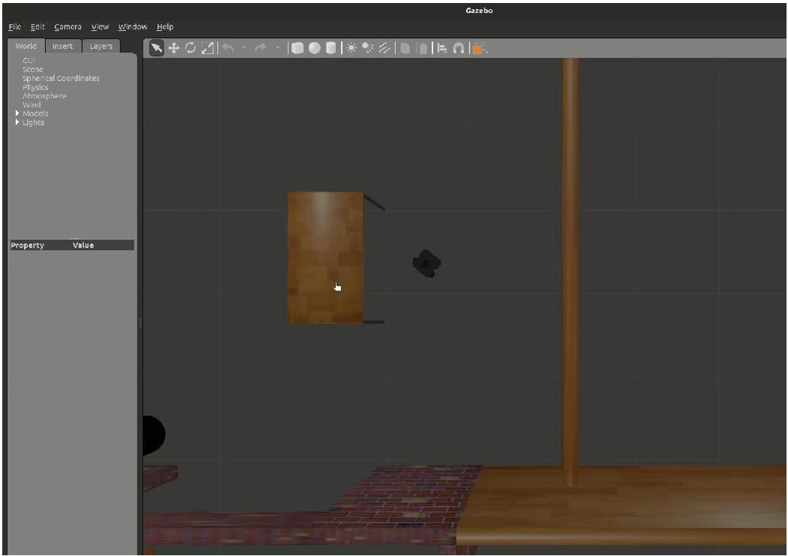

# ROS TurtleBot3 Simulation and Density-Based Traffic Control System

This repository contains two robotics and embedded systems implementations:

1. **TurtleBot3 Simulation using ROS Noetic and Gazebo**
2. **Density-Based Traffic Signal Control using Arduino and Ultrasonic Sensor**

The project demonstrates concepts from **robotics simulation, autonomous navigation, and intelligent traffic management systems**.


# Project Overview

Modern robotics and traffic management systems rely heavily on **automation and sensor-driven decision making**.

This project explores:

- Robot simulation and obstacle avoidance using ROS
- Autonomous robot control using laser scan data
- Smart traffic signal control based on real-time vehicle density
- Embedded system implementation using Arduino

---

# Technologies Used

### Robotics Simulation
- ROS Noetic
- Gazebo Simulator
- C++

### Embedded Systems
- Arduino
- Ultrasonic Sensor
- LED Traffic Signal System

### Tools
- Ubuntu Linux
- Arduino IDE

---

# Project Architecture

```
                    +-----------------------+
                    |   ROS TurtleBot3      |
                    |   Simulation System   |
                    +-----------------------+
                               |
                               v
                        Gazebo Simulator
                               |
                               v
                   Obstacle Detection via LaserScan
                               |
                               v
                       Velocity Command Publisher


              +--------------------------------------+
              | Density Based Traffic Control System |
              +--------------------------------------+
                               |
                               v
                      Ultrasonic Sensor
                               |
                               v
                       Arduino Controller
                               |
                               v
                         Traffic Lights


# Repository Structure

```
ros-turtlebot-traffic-control-system
│
├── ros_turtlebot_simulation
│
├── arduino_traffic_control
│
├── docs
│   └── project_report.pdf
│
├── screenshots
│   ├── gazebo_simulation.png
│   └── traffic_control_system.png
│
├── demo
│   └── demo_video_link.md
│
└── README.md
```

---

# TurtleBot3 Simulation (ROS + Gazebo)

The TurtleBot3 simulation demonstrates **robot navigation and obstacle avoidance** in a simulated environment using Gazebo.

### Key Features

- Robot simulation using Gazebo
- LaserScan based obstacle detection
- Autonomous movement control
- Velocity command publishing via ROS nodes

### Running the Simulation

Launch Gazebo environment:

```
roslaunch turtlebot3_gazebo turtlebot3_world.launch
```

Run the control node:

```
rosrun turtlebot3_simulation turtlebot3_drive
```

The robot will navigate the environment and avoid obstacles using laser scan data.

---

# Density-Based Traffic Control System (Arduino)

This system dynamically adjusts traffic signal timing based on **vehicle density detected by an ultrasonic sensor**.

Traditional traffic systems operate on fixed timers, which can cause unnecessary delays. This project demonstrates an **intelligent traffic control mechanism**.

### Key Features

- Vehicle detection using ultrasonic sensor
- Dynamic signal timing adjustment
- Embedded control using Arduino
- LED based traffic signal simulation

### Components Used

- Arduino UNO
- Ultrasonic Sensor
- LEDs
- Resistors
- Breadboard

---

# Demo Video

Project demonstration video:

https://drive.google.com/drive/folders/1u_KqdOeeTbtPLrWHiv9JNJu7c9IhBT6A

---

# Screenshots

### TurtleBot3 Simulation in Gazebo




---

# Results

- Successful TurtleBot3 simulation in Gazebo environment
- Autonomous obstacle avoidance using ROS LaserScan data
- Traffic signal duration dynamically adjusted based on vehicle density
- Efficient traffic flow management through sensor-based automation

---

# Conclusion

This project demonstrates the integration of **robotics simulation and intelligent traffic control systems**.

The ROS-based robot simulation showcases autonomous navigation concepts, while the Arduino-based traffic system highlights how sensor-driven automation can improve traffic management.

---

# References

TurtleBot3 Simulation Guide  
https://emanual.robotis.com/docs/en/platform/turtlebot3/simulation/

Density Based Traffic Control System  
https://www.instructables.com/Traffic-Signal-Using-Arduino-and-Ultrasonic-Sensor/

---
