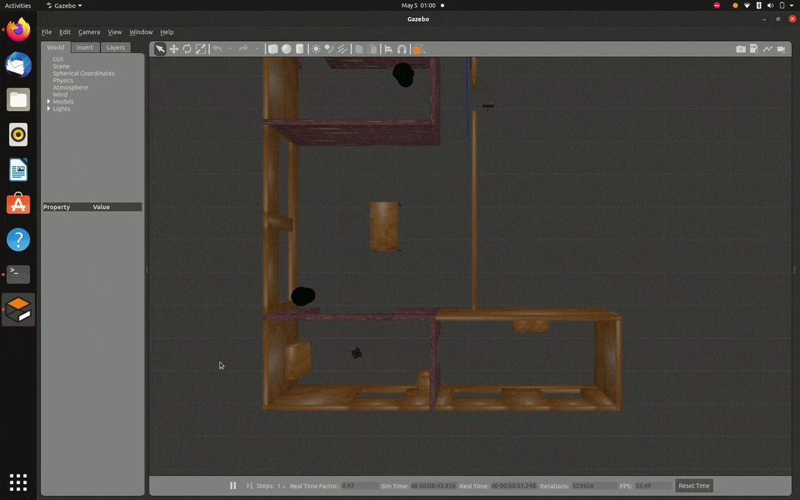

# ROS TurtleBot3 Simulation and Density-Based Traffic Control System

This repository presents two implementations demonstrating concepts from robotics simulation and embedded systems.

• TurtleBot3 simulation using **ROS Noetic and Gazebo**  
• Density-based traffic signal control using **Arduino and ultrasonic sensing**

The project explores how sensor-driven automation can be applied to robotic navigation and intelligent traffic management systems.

---

## Demo

### TurtleBot3 Simulation



### Density-Based Traffic Control


---

## Technologies

### Robotics Simulation
- ROS Noetic
- Gazebo Simulator
- C++

### Embedded Systems
- Arduino
- Ultrasonic Sensor
- 7-Segment Display
- LED Traffic Signals

### Development Tools
- Ubuntu Linux
- Arduino IDE

---

## System Architecture

```
+-----------------------------+
| ROS TurtleBot3 Simulation   |
+-----------------------------+
             |
             v
      Gazebo Simulator
             |
             v
 LaserScan Obstacle Detection
             |
             v
   Velocity Command Publisher


+----------------------------------+
| Density Based Traffic Controller |
+----------------------------------+
             |
             v
      Ultrasonic Sensor
             |
             v
        Arduino UNO
             |
             v
        Traffic Signals
```

---

## Repository Structure

```
ros-turtlebot-traffic-control-system
│
├── ros_turtlebot_simulation
│   └── turtlebot3_drive_node.cpp
│
├── arduino_traffic_control
│   ├── traffic_signal_basic.ino
│   └── density_based_traffic_control.ino
│
├── docs
│   └── project_report.pdf
│
├── demo
│   ├── turtlebot_simulation.gif
│   └── traffic_control.gif
│
└── README.md
```

---

## ROS TurtleBot3 Simulation

The simulation demonstrates autonomous robot navigation using ROS and Gazebo. Laser scan data from the robot is processed to detect obstacles and generate velocity commands.

### Running the Simulation

Launch the Gazebo environment:

```
roslaunch turtlebot3_gazebo turtlebot3_world.launch
```

Run the control node:

```
rosrun turtlebot3_simulation turtlebot3_drive
```

---

## Density-Based Traffic Control System

This embedded system dynamically adjusts traffic signal timing based on vehicle detection using an ultrasonic sensor.

Two implementations are included:

**traffic_signal_basic.ino**

Basic traffic signal system with a seven-segment countdown display.

**density_based_traffic_control.ino**

Enhanced system that detects vehicles using an ultrasonic sensor and adjusts green signal duration accordingly.

---

## Reference

TurtleBot3 Simulation Documentation  
https://emanual.robotis.com/docs/en/platform/turtlebot3/simulation/

Arduino Ultrasonic Sensor Documentation  
https://www.arduino.cc/en/reference
